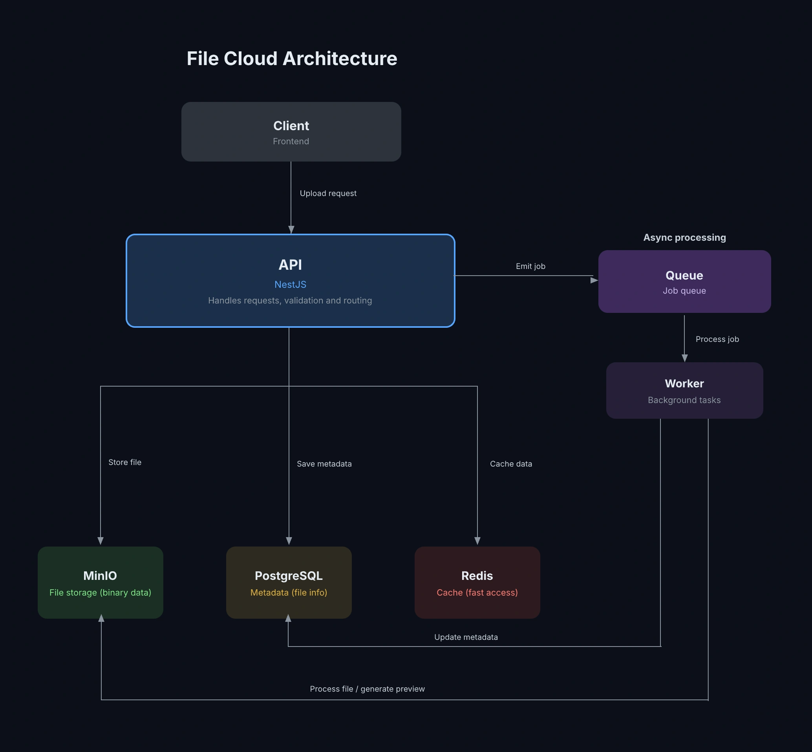

# Hi, I'm Artem

Full-Stack Developer with 6+ years of experience building complex web applications in production.

I work across both frontend and backend using Vue, Nuxt, React, Next.js, Node.js, and NestJS.
Experienced in system architecture, REST APIs, PostgreSQL, and event-driven systems.
Regularly work with AWS (S3, Lambda, EC2, RDS) and actively use AI tools like Claude Code and Cursor,
including agentic workflows, MCP integration, and AI-assisted development to speed up delivery.

## Tech Stack

**Frontend**
- Vue / Nuxt
- React / Next

**Backend**
- Node.js
- NestJS / Express
- REST API / GraphQL
- JWT / RBAC
- RabbitMQ
- WebSockets

**Database**
- PostgreSQL
- MongoDB
- Prisma
- Redis

**Cloud**
- AWS S3 / Lambda / SQS
- AWS EC2 / RDS / ElastiCache
- AWS CloudFront / IAM / VPC
- Docker / Docker Compose

**AI Tools**
- Claude Code / Cursor / GitHub Copilot
- Agentic Workflows / MCP Integration

## Selected Projects

Public projects demonstrating my approach to fullstack development, frontend architecture and working with data and APIs.

Commercial experience includes production systems developed under NDA.

### File Cloud Lab  
Fullstack file storage system

A fullstack application for handling file uploads, storage and metadata management, designed with separation between storage, database and caching layers.

- File upload and storage using MinIO
- Metadata management with PostgreSQL
- Caching layer with Redis
- Backend built with NestJS
- Separation of storage and application logic

Focus on data flow, backend structure and integration between services

### Architecture overview

System showing synchronous request flow and asynchronous background processing using queue and workers.

[Open project](https://github.com/Artem-Makarchenko-Dev/file-cloud-lab)

---

### Shop Kit  
Fullstack e-commerce platform

- Authentication with JWT and refresh tokens
- Role-based access control
- Backend API and frontend application
- Modular project structure

API  
[Open project](https://github.com/Artem-Makarchenko-Dev/shop-kit-api)

Web  
[Open project](https://github.com/Artem-Makarchenko-Dev/shop-kit-web)

---

### Microfrontends Lab  
Frontend architecture experiment using Module Federation

- Independent applications
- Shared components
- Focus on modular frontend structure

[Open project](https://github.com/Artem-Makarchenko-Dev/microfrontends-vue-lab)

---

## Focus

- Frontend development
- Fullstack applications
- Modular architecture
- Working with APIs and data

## Links

Portfolio  
https://artem-makarchenko-dev.com  

LinkedIn  
https://www.linkedin.com/in/artem-makarchenko-dev/
